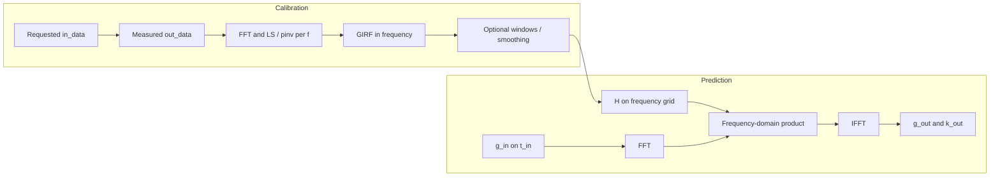

# PyGIRF: concepts and algorithm

This document explains how the repository is organized, what the **gradient impulse response function (GIRF)** represents in this code, and how estimation (`GirfProvider`) and prediction (`GirfApplier`) work end to end.

For installation, quick start, and citations, see the [home page](index.md).

---

## 1. What problem this package solves

MRI gradient systems do not reproduce the commanded gradient waveforms perfectly. Eddy currents, filters, amplifier limits, and crosstalk between channels mean the **actual magnetic field** differs from the **requested** one. For reconstruction and pulse design it is useful to treat the hardware as a **linear time-invariant (LTI)** system.

The **GIRF** is the transfer function of that system: it maps **commanded gradients** (inputs) to **actual fields**, often expressed in a **spherical harmonic basis** (output “basis” indices). This package:

1. **Estimates** the GIRF from calibration measurements (`GirfProvider`).
2. **Applies** the GIRF to predict actual gradients and k-space trajectories for arbitrary requests (`GirfApplier`).

The theory and applications follow the Zurich group’s work; see the papers on the [home page](index.md#citations).

---

## 2. Repository layout

| Location | Role |
|----------|------|
| `src/pygirf/core.py` | `GirfEssential` (storage, save/load, domain conversion), `GirfProvider` (fit from data), `GirfApplier` (forward model), optional plotting via `vis()` |
| `src/pygirf/utils.py` | Time/frequency grids (`time2freq`), bandwidth windows and filtering (`bw_window`, `bw_filter`, `raised_cosine`), variable smoothing, synthetic waveforms (`sweeps`, `trapezoid`), helpers such as `compute_inputs` |
| `src/pygirf/__init__.py` | Public exports |
| `demo_pygirf.py`, `demo2.py` | Runnable examples: synthetic I/O → fit → optional smoothing → prediction |

---

## 3. Signals and array shapes

### Inputs and outputs in calibration

- **`in_data`**: Requested gradient commands. Shape **(time × input channels × waveforms)**. Multiple **waveforms** are separate calibration pulses used together to identify the system.
- **`out_data`**: Measured field (or processed camera data). Shape **(time × output basis × waveforms)**. The **output basis** is a list of integer indices (e.g. spherical harmonic order); see `out_basis` in `GirfProvider`.
- **Time alignment**: `time_in` and `time_out` must match: same length and sampling step. `compute_girf()` enforces this.

### Channel names

Logical names like `"X"`, `"Y"`, `"Z"` map to basis indices for plotting and self-term selection via `GirfEssential.self_basis` (see `core.py`).

### What the GIRF stores

- **`girf`**: Complex transfer, typically **frequency domain**, shape **(frequency × n_out_basis × n_in_channels)**.
- **`girf_time` / `time`**: Inverse FFT of `girf` for time-domain viewing and some operations.
- **`freq`**: Frequency axis paired with `girf`.

---

## 4. Estimation: `GirfProvider.compute_girf`

The model at each frequency is that the output spectrum is approximately linear in the input spectrum:

\[
\mathbf{Y}(f) \approx G(f)\,\mathbf{X}(f)
\]

where columns correspond to **waveforms**. The code FFTs `in_data` and `out_data` along time to obtain `in_freq` and `out_freq`, then solves for \(G(f)\) per frequency bin.

Three cases are implemented:

1. **Single input channel** (`nIn == 1`): For each output row and frequency, a **least-squares** combination across waveforms is used: correlation of output with input divided by the energy in the input spectrum (scalar \(G\) per frequency per output).

2. **Multiple inputs, separable calibration**: If each waveform excites at most one input channel (detected by which `in_freq` bins have significant energy), the code solves **per input channel** without a full matrix inversion at every frequency.

3. **Full MIMO** (multiple inputs active on the same waveform): At each frequency,

   \[
   G(f) = Y(f)\,X(f)^+
   \]

   using the **Moore–Penrose pseudoinverse** `numpy.linalg.pinv` — i.e. least squares in the frequency domain.

NaNs are zeroed. The result is stored in **`girf`** on **`freq`**, and **`convert_domain("freq2time")`** also fills **`girf_time`** and **`time`**.

---

## 5. Post-processing (optional)

After `compute_girf`, you may stabilize or band-limit the estimate:

| Method | Purpose |
|--------|---------|
| `window_freq` | Multiply `girf` by a bandwidth window (raised-cosine, Gaussian, Blackman, etc.) in **frequency**. |
| `window_time` | Same idea in the **time** domain on `girf_time`. |
| `var_smooth_freq` | **Frequency-dependent smoothing** via `variable_smoothing` in `utils.py` (narrower smoothing where appropriate). |
| `peak_elimination` | Replace narrow spectral peaks (e.g. artifacts) by a polynomial fit from neighbors, preserving Hermitian symmetry where needed. |

These are optional; real data often benefits from at least mild band-limiting or smoothing.

---

## 6. Prediction: `GirfApplier.predict_grad`

This implements the **forward LTI model** for new trajectories.

1. **Build \(H(f)\)** from the stored `girf` for the requested logical channels (`pred_channels`), matching `in_channels` indices.

2. **Zero-pad** the input gradient in time so the FFT length is consistent with the GIRF duration and observation window (the code uses the minimum of a GIRF-related span and the time span of input/output).

3. **Interpolate** \(H(f)\) from the GIRF frequency grid onto the input’s frequency grid (zeros outside the supported band).

4. **`conv_type == "conv"`** (typical in demos): Transform to time, **truncate** the impulse response to a finite support window, then transform back. That favors **linear convolution**-like behavior instead of a pure circular frequency product.

5. **Multiply in frequency**: For each waveform index, \(\mathrm{OUT} = \sum_{\text{inputs}} \mathrm{IN} \cdot H\) (broadcast over output basis).

6. **Inverse FFT** to get predicted **gradient** `g_out`. The **k-space** trajectory uses cumulative summation with \(\gamma\) (`gamma1H` for hydrogen): `k_out`.

7. **Interpolate** onto `t_out` if the requested time grid differs from the padded input grid.

Returns typically include predicted gradient, k-space, and the time samples for k-space.

---

## 7. End-to-end flow



In short: **calibration** identifies \(G(f)\) from measured spectra; **prediction** applies \(G(f)\) to new commands, with optional time-domain truncation for convolution semantics.

---

## 8. Running the demos

From the repository root, with dependencies installed (`python3 -m pip install -e .`):

```bash
python3 demo_pygirf.py
python3 demo2.py
```

The demos use **synthetic** inputs and band-limited pseudo-measurements (not real scanner data). Replace `in_data` / `out_data` with your calibration when moving to experiments.

---

## 9. Practical checklist for real use

1. Resample **input and output** to a **common** time grid before `compute_girf`.
2. Set **`in_channels`** and **`out_basis`** consistently with your acquisition.
3. After fitting, inspect the GIRF (`vis()` or your own plots); apply **windows** or **smoothing** if the estimate is noisy.
4. For prediction, **`g_in`** must have one column per entry in **`pred_channels`**, and those names must exist in **`in_channels`**.

For API details, see docstrings in `src/pygirf/core.py` and `src/pygirf/utils.py`.
